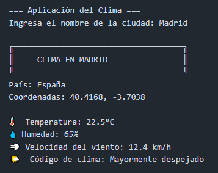
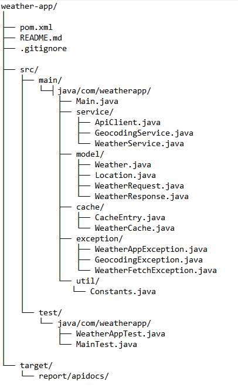
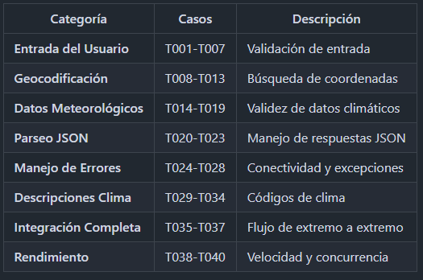
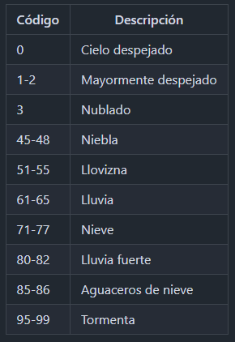

# 🌤️ Weather App - Aplicación del Clima

Una aplicación simple en **Java** que obtiene datos meteorológicos en tiempo real de cualquier ciudad del mundo usando la **API de Open-Meteo**.

## 📋 Características

- ✅ Búsqueda de ciudades por nombre
- ✅ Obtención automática de coordenadas geográficas
- ✅ Datos meteorológicos actualizados en tiempo real
- ✅ Información de temperatura, humedad y velocidad del viento
- ✅ Interfaz amigable y formato legible
- ✅ Manejo robusto de errores
- ✅ Sin dependencias de claves API (Open-Meteo es gratuito)
- ✅ JavaDoc generado

## 📦 Requisitos

- **Java 11+**
- **Maven 3.6+** 
- Conexión a Internet

## 🚀 Instalación

### 1. Clonar o descargar el proyecto

- git clone git@github.com:karen-valenzuela-landero/weather-app.git
- cd weather-app

### 2. Instalar dependencias

mvn clean install

### 3. Compilar el proyecto

mvn compile

## 🎯 Uso

Ejecutar la aplicación
- mvn exec:java -Dexec.mainClass="Main"

O compilar y ejecutar manualmente:
- javac -cp ".:gson-2.10.1.jar" Main.java WeatherData.java
- java -cp ".:gson-2.10.1.jar" Main

### Ejemplo de ejecución

## 📂 Estructura del Proyecto

## 🔧 Componentes Principales

Main.java
- Responsabilidad: Punto de entrada de la aplicación
- Funciones principales:
  - main(): Flujo principal de la aplicación
  - getWeather(): Obtiene datos meteorológicos de una ciudad
  - makeRequest(): Realiza peticiones HTTP a las APIs
  - displayWeather(): Muestra los datos de forma legible
  - getWeatherDescription(): Convierte códigos de clima a descripciones

WeatherData.java
- Responsabilidad: Modelo de datos
- Atributos:
  - city: Nombre de la ciudad
  - country: País
  - latitude: Latitud
  - longitude: Longitud
  - temperature: Temperatura en °C
  - weatherCode: Código de clima
  - humidity: Humedad en %
  - windSpeed: Velocidad del viento en km/h

## 🌐 APIs Utilizadas

1. Geocoding API (Open-Meteo)
- URL: https://geocoding-api.open-meteo.com/v1/search
- Busca coordenadas de una ciudad por nombre.
- Parámetros:
 - name: Nombre de la ciudad
 - count: Número de resultados (1)
 - language: Idioma (es)
 - format: Formato de respuesta (json)

2. Forecast API (Open-Meteo)
- URL: https://api.open-meteo.com/v1/forecast
- Obtiene datos meteorológicos actuales.
- Parámetros:
 - latitude: Latitud
 - longitude: Longitud
 - current: Variables actuales (temperature_2m, weather_code, etc.)
 - timezone: Zona horaria automática (auto)

## 🧪 Pruebas

El proyecto incluye 40 casos de prueba organizados en las siguientes categorías:

### Ejecutar todas las pruebas

mvn test

### Categorías de Pruebas

### Pruebas Unitarias Clave

// Prueba de entrada válida
@Test
public void testCiudadValida() {
    String ciudad = "Madrid";
    assertNotNull(ciudad);
    assertTrue(ciudad.length() > 0);
}

// Prueba de temperatura en rango válido
@Test
public void testTemperaturaRangoValido() {
    double temp = 22.5;
    assertTrue(temp >= -50 && temp <= 50);
}

// Prueba de manejo de errores
@Test
public void testCiudadNoEncontrada() {
    assertThrows(Exception.class, () -> {
        throw new Exception("Ciudad no encontrada");
    });
}

## 📚 Dependencias

El proyecto utiliza las siguientes dependencias:

- Gson 2.10.1: Parseo de JSON
- JUnit 5 5.9.2: Framework de pruebas
- Mockito 5.2.0: Mocking para pruebas

Todas se definen en el archivo pom.xml.

## 🌡️ Códigos de Clima Soportados

## 🐛 Manejo de Errores

La aplicación captura y maneja los siguientes errores:

- ❌ Ciudad no encontrada: Si el nombre de la ciudad no existe
- ❌ Conexión rechazada: Si no hay conexión a Internet
- ❌ Timeout: Si la respuesta tarda más de 5 segundos
- ❌ Error HTTP: Códigos de error 404, 500, etc.
- ❌ JSON malformado: Si la API retorna JSON inválido
- ❌ Entrada vacía: Si el usuario no ingresa un nombre

## 📋 Ejemplo de Flujo

1. Usuario ingresa nombre de ciudad
2. Aplicación valida la entrada
3. Se realiza petición a Geocoding API
4. Se obtienen coordenadas (latitud, longitud)
5. Se realiza petición a Forecast API
6. Se extraen datos meteorológicos
7. Se formatea y muestra la información

## 📈 Mejoras Futuras

 - Agregar predicción del clima para los próximos 7 días
 - Guardar ciudades favoritas
 - Interfaz gráfica con JavaFX
 - Caché de datos para reducir peticiones API
 - Soporte para múltiples idiomas
 - Notificaciones de alertas climáticas
 - Integración con bases de datos
 - API REST propio para la aplicación

## 🤝 Contribuciones

Las contribuciones son bienvenidas. Para contribuir:

1. Fork el proyecto
2. Crea una rama para tu feature (git checkout -b feature/AmazingFeature)
3. Commit tus cambios (git commit -m 'Add some AmazingFeature')
4. Push a la rama (git push origin feature/AmazingFeature)
5. Abre un Pull Request

## 📜 Licencia

Este proyecto está bajo la licencia MIT. Ver el archivo LICENSE para más detalles.

## 👤 Autor

Karen Valenzuela Landero
- GitHub: @karen-valenzuela-landero

## 📞 Soporte

Si encuentras problemas o tienes preguntas:

1. Revisa los problemas existentes
2. Crea un nuevo issue con descripción detallada
3. Incluye logs de error y pasos para reproducir

## 🔗 Enlaces Útiles

- [Documentación de Open-Meteo](https://open-meteo.com/en/docs)
- [Documentación de Java HttpURLConnection](https://docs.oracle.com/en/java/javase/11/docs/api/java.base/java/net/HttpURLConnection.html)
- [Documentación de Gson](https://github.com/google/gson/blob/master/README.md)
- [Documentación de JUnit 5](https://junit.org/junit5/docs/current/user-guide/)

## Este README incluye:

- ✅ Descripción clara del proyecto
- ✅ Requisitos e instalación
- ✅ Instrucciones de uso con ejemplos
- ✅ Estructura del proyecto
- ✅ Documentación de componentes
- ✅ Información sobre APIs utilizadas
- ✅ Detalles completos de pruebas
- ✅ Lista de dependencias
- ✅ Códigos de clima soportados
- ✅ Manejo de errores
- ✅ Mejoras futuras
- ✅ Información de contribución y licencia

Estado: ✅ Funcional y listo para uso

Última actualización: 22 de abril de 2026